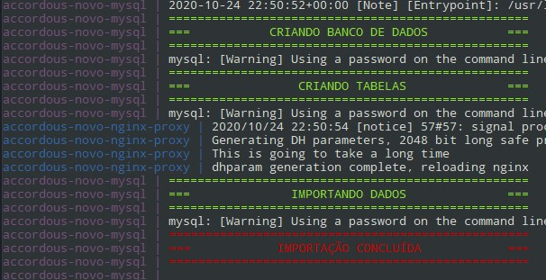

### Executando o Teste Full Stack Laravel
##
A instalação é feita com o Docker (docker-compose). Os serviços incluídos são:
- Proxy nginx para acesso do frontend e backend
- Mysql para banco de dados do backend
- Memcache e redis para cache do frontend e backend
- Nginx-PHP para o frontend (acessavel pelo proxy nginx)
- Nginx-PHP para o backend (acessavel pelo proxy nginx)
- PHP para a laravel queue do backend
- Composer para instalação dos pacotes necessários
##
Antes de executar a instalação, confira as configurações no arquivo `.env` na raiz do repositório. Nele contém a porta de acesso padrão `8988` e o hostname padrão da URL de acesso `accordous.laravel`, mude se necessário e insira no seu arquivo de hosts os endereços:

```
XXX.XXX.XXX.XXX HOST_NAME
XXX.XXX.XXX.XXX backend.HOST_NAME
```

Por exemplo
```
192.168.2.3 accordous.laravel
192.168.2.3 backend.accordous.laravel
```

Esteja atento a variável `DOCKER_SOCKET` que é necessária para o serviço `nginx-proxy`, por padrão está o caminho do socket do docker `DOCKER_SOCKET=/var/run/docker.sock` no linux, mude para o caminho do seu setup caso necessário.

##
Para executar a instalação pela primeira vez rode o seguinte comando:

`docker-compose up composer mysql redis memcached nginx-proxy frontend backend queue`

Esteja atento para a mensagem de conclusão da criação/importação do banco de dados inicial (importação de cidades/estados pode demorar um pouco):



Para executar novamente após a primeira execução rode o seguinte comando que irá iniciar todos os serviços necessários:

`docker-compose up nginx-proxy`
##
Para executar o Teste unitário de backend rode o seguinte comando:

`docker-compose exec backend php ./vendor/phpunit/phpunit/phpunit --group backend`
##
Para executar o Teste de integração backend rode o seguinte comando:

`docker-compose exec backend php ./vendor/phpunit/phpunit/phpunit --group frontend`
##
O acesso ao sistema é feito pelo endereço por padrão `http://accordous.laravel:8988/login`, confira caso tenha feito alguma alteração nas variáveis do arquivo `.env`.

Usuário `admin`

Senha: `admin`

Qualquer dúvida ou problemas sinta-se livre para entrar em contato.
#
### Sobre a Accordous
##### Não perca mais tempo com seus contratos.
Somos uma empresa de tecnologia voltada a simplificação de processos burocráticos! Desde a concepção até a cobrança de contratos, seja ele de imóveis, acordo, prestação de serviços, entre outros.


##### Teste Full Stack Laravel
O objetivo deste teste é entendermos um pouco mais sobre seus conhecimentos de Frontend e Backend no Laravel.

##### Requisitos
- PHP 7.1+
- Laravel (Preferência 5.8+)
- Vue.JS
- Docker Engine

##### Orientações
Faça um fork deste projeto.

Para facilitar o seu desenvolvimento, nós disponibilizamos um ``docker-compose.yml`` com o serviços que utilizamos habitualmente no nosso dia a dia.

#### O Desafio
Simular o cadastro de uma propriedade e criar um contrato para o mesmo.

##### Funcionalidade 1:
  - Permitir o cadastro de um imóvel com algumas características.
  - o cadastro de um imóvel deve possuir:
  - e-mail do proprietário, rua, número, complemento, bairro, cidade, estado;

Para que o cadastro ocorra deverá haver validações em dois níveis. Frontend e backend:
- 1 - e-mail, rua, bairro, cidade e estado são campos obrigatórios;
- 2 - e-mail deverá ser validado;

##### Funcionalidade 2:
  - Contexto: Permitir visualização dos imóveis cadastrados.
    Os dados de imóveis deverão ser carregados via request assíncrona. Esses dados deverão ser exibidos numa tabela e ao menos uma das colunas serem ordenáveis.
    Dados que deverão ser exibidos na tabela:
  - E-mail do proprietário;
  - Rua, número, cidade, estado (separados por vírgula);
  - Status (Contratado / Não contratado)
  - Coluna para ações (remover).

##### Funcionalidade 3:
  - Contexto: permitir a remoção de uma propriedade via chamada assíncrona com atualização posterior da lista de propriedades.
  - Observação: a remoção de uma propriedade deverá ser virtual.

##### Funcionalidade 4:
  - Contexto: Criação de um contrato que permita associação com uma propriedade. Um contrato possui os seguintes campos:
  - Propriedade (deverá ser selecionável a propriedade. Sendo usado como informação da propriedade a rua, número, complemento, bairro);
  - Tipo de pessoa (Pessoa física ou Pessoa Jurídica);
  - Documento (A máscara do campo de documento deverá alterar de acordo com o tipo de pessoa. Pessoa física deverá ser máscara de CPF e pessoa jurídica deverá ser máscara de CNPJ)
  - E-mail do contratante;
  - Nome completo do contratante;

##### Regras específicas sobre a criação de contrato:
- Uma propriedade não pode estar associada a dois contratos;
- Todos os campos do contrato são obrigatórios;
- Deverá ocorrer validação do documento;
- Deverá ocorrer validação do e-mail;


### Extras
- Job: deve-se utilizar alguma forma de job;
- Teste unitário de backend;
- Teste de integração backend;
- SPA.
- Usabilidade (A usabilidade das funcionalidades fica a cargo do desenvolvedor) :D


### Entrega
Deixar um repositório público e nos enviar por e-mail - o mesmo e-mail que foi enviado o teste.
